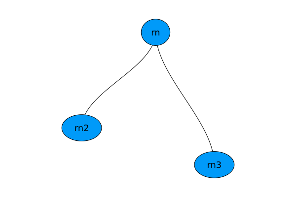

# [Compositional Modeling of Reaction Systems](@id compositional_modeling)
Catalyst supports the construction of models in a compositional fashion, based
on ModelingToolkit's subsystem functionality. In this tutorial we'll see how we
can construct the earlier repressilator model by composing together three
identically repressed genes, and how to use compositional modeling to create
compartments.

## Compositional modeling tooling
Catalyst supports two ModelingToolkit interfaces for composing multiple
[`ReactionSystem`](@ref)s together into a full model. The first mechanism for
extending a system is the `extend` command
```@example ex1
using Catalyst
basern = @reaction_network rn1 begin
  k, A + B --> C
end
newrn = @reaction_network rn2 begin
  r, C --> A + B
end
@named rn = extend(newrn, basern)
```
Here we extended `basern` with `newrn` giving a system with all the
reactions. Note, if a name is not specified via `@named` or the `name` keyword
then `rn` will have the same name as `newrn`.

The second main compositional modeling tool is the use of subsystems. Suppose we
now add to `basern` two subsystems, `newrn` and `newestrn`, we get a
different result:
```@example ex1
newestrn = @reaction_network rn3 begin
            v, A + D --> 2D
           end
@named rn = compose(basern, [newrn, newestrn])
```
Here we have created a new `ReactionSystem` that adds `newrn` and `newestrn` as
subsystems of `basern`. The variables and parameters in the sub-systems are
considered distinct from those in other systems, and so are namespaced (i.e.
prefaced) by the name of the system they come from.

We can see the subsystems of a given system by
```@example ex1
ModelingToolkit.get_systems(rn)
```
They naturally form a tree-like structure
```julia
using Plots, GraphRecipes
plot(TreePlot(rn), method=:tree, fontsize=12, nodeshape=:ellipse)
```


We could also have directly constructed `rn` using the same reaction as in
`basern` as
```@example ex1
@parameters k
@variables t, A(t), B(t), C(t)
rxs = [Reaction(k, [A,B], [C])]
@named rn  = ReactionSystem(rxs, t; systems = [newrn, newestrn])
```

Catalyst provides several different accessors for getting information from a single system,
or all systems in the tree. To get the species, parameters, and equations *only* within a given system (i.e. ignoring subsystems), we can use
```@example ex1
ModelingToolkit.get_states(rn)
```
```@example ex1
ModelingToolkit.get_ps(rn)
```
```@example ex1
ModelingToolkit.get_eqs(rn)
```
To see all the species, parameters and reactions in the tree we can use
```@example ex1
species(rn)   # or states(rn)
```
```@example ex1
parameters(rn)  # or reactionparameters(rn)
```
```@example ex1
reactions(rn)   # or equations(rn)
```

If we want to collapse `rn` down to a single system with no subsystems we can use
```@example ex1
flatrn = Catalyst.flatten(rn)
```
where
```@example ex1
ModelingToolkit.get_systems(flatrn)
```

More about ModelingToolkit's interface for compositional modeling can be found
in the [ModelingToolkit docs](http://docs.sciml.ai/ModelingToolkit/stable/).

## Compositional model of the repressilator
Let's apply the tooling we've just seen to create the repressilator in a more
modular fashion. We start by defining a function that creates a negatively
repressed gene, taking the repressor as input
```@example ex1
function repressed_gene(; R, name)
  @reaction_network $name begin
    hillr($R,α,K,n), ∅ --> m
    (δ,γ), m <--> ∅
    β, m --> m + P
    μ, P --> ∅
  end
end
nothing # hide
```
Here we assume the user will pass in the repressor species as a ModelingToolkit
variable, and specify a name for the network. We use Catalyst's interpolation
ability to substitute the value of these variables into the DSL (see
[Interpolation of Julia Variables](@ref)). To make the repressilator we now make
three genes, and then compose them together
```@example ex1
@variables t, G3₊P(t)
@named G1 = repressed_gene(; R=ParentScope(G3₊P))
@named G2 = repressed_gene(; R=ParentScope(G1.P))
@named G3 = repressed_gene(; R=ParentScope(G2.P))
@named repressilator = ReactionSystem(t; systems=[G1,G2,G3])
```
Notice, in this system each gene is a child node in the system graph of the repressilator
```julia
plot(TreePlot(repressilator), method=:tree, fontsize=12, nodeshape=:ellipse)
```


In building the repressilator we needed to use two new features. First, we
needed to create a symbolic variable that corresponds to the protein produced by
the third gene before we created the corresponding system. We did this via
`@variables t, G3₊P(t)`. We also needed to set the scope where each repressor
lived. Here `ParentScope(G3₊P)`, `ParentScope(G1.P)`, and `ParentScope(G2.P)`
signal Catalyst that these variables will come from parallel systems in the tree
that have the same parent as the system being constructed (in this case the
top-level `repressilator` system).

## Compartment-based models
Finally, let's see how we can make a compartment-based model. Let's create a
simple eukaryotic gene expression model with negative feedback by protein
dimers. Transcription and gene inhibition by the protein dimer occurs in the
nucleus, translation and dimerization occur in the cytosol, and nuclear import
and export reactions couple the two compartments. We'll include volume
parameters for the nucleus and cytosol, and assume we are working with species
having units of number of molecules. Rate constants will have their common
concentration units, i.e. if ``V`` denotes the volume of a compartment then

| Reaction Type | Example | Rate Constant Units | Effective rate constant (units of per time)
|:----------:   | :----------: | :----------:  |:------------:|
| Zero order | ``\varnothing \overset{\alpha}{\to} A`` | concentration / time | ``\alpha V`` |
| First order | ``A \overset{\beta}{\to} B`` | (time)⁻¹ | ``\beta`` |
| Second order | ``A + B \overset{\gamma}{\to} C`` | (concentration × time)⁻¹ | ``\gamma/V`` |

In our model we'll therefore add the conversions of the last column to properly
account for compartment volumes:
```@example ex1
# transcription and regulation
nuc = @reaction_network nuc begin
  α, G --> G + M
  (κ₊/V,κ₋), D + G <--> DG
end

# translation and dimerization
cyto = @reaction_network cyto begin
  β, M --> M + P
  (k₊/V,k₋), 2P <--> D
  σ, P --> 0
  μ, M --> 0
end

# export reactions,
# γ,δ=probability per time to be exported/imported
model = @reaction_network model begin
  γ, $(nuc.M) --> $(cyto.M)
  δ, $(cyto.D) --> $(nuc.D)
end
@named model = compose(model, [nuc, cyto])
```
A graph of the resulting network is
```julia
Graph(model)
```

