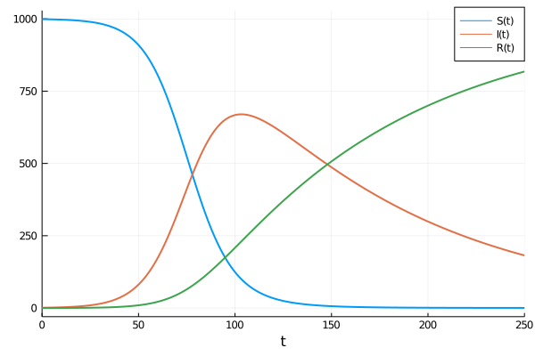

# Catalyst.jl for Reaction Models

Catalyst.jl is a domain specific language (DSL) for high performance simulation
and modeling of chemical reaction networks. Catalyst utilizes
[ModelingToolkit](https://github.com/SciML/ModelingToolkit.jl)
`ReactionSystem`s, leveraging ModelingToolkit to enable large-scale simulations
through auto-vectorization and parallelism. `ReactionSystems`s can be used to
generate ModelingToolkit-based models, allowing the easy simulation and
parameter estimation of mass action ODE models, Chemical Langevin SDE models,
stochastic chemical kinetics jump process models, and more. Generated models can
be used with solvers throughout the broader [SciML](https://sciml.ai) ecosystem,
including higher level SciML packages (e.g. for sensitivity analysis, parameter
estimation, machine learning applications, etc).

## Features
- DSL provides a simple and readable format for manually specifying chemical
  reactions.
- The [Catalyst.jl API](@ref) provides functionality for extending networks,
  building networks programmatically, and for composing multiple networks
  together.
- `ReactionSystem`s generated by the DSL can be converted to a variety of
  `ModelingToolkit.AbstractSystem`s, including ODE, SDE and jump process
  representations.
- By leveraging ModelingToolkit, users have a variety of options for generating
  optimized system representations to use in solvers. These include construction
  of dense or sparse Jacobians, multithreading or parallelization of generated
  derivative functions, automatic classification of reactions into optimized
  jump types for Gillespie type simulations, automatic construction of
  dependency graphs for jump systems, and more.
- Generated systems can be solved using any
  [DifferentialEquations.jl](https://github.com/SciML/DifferentialEquations.jl)
  ODE/SDE/jump solver, and can be used within `EnsembleProblem`s for carrying
  out GPU-parallelized parameter sweeps and statistical sampling. Plot recipes
  are available for visualizing the solutions.
- Julia `Expr`s can be obtained for all rate laws and functions determining the
  deterministic and stochastic terms within resulting ODE, SDE or jump models.
- [Latexify](https://github.com/korsbo/Latexify.jl) can be used to generate
  LaTeX expressions corresponding to generated mathematical models or the
  underlying set of reactions.
- [Graphviz](https://graphviz.org/) can be used through
  [Catlab.jl](https://github.com/AlgebraicJulia/Catlab.jl/) to generate and
  visualize reaction network graphs.

## Installation
Catalyst can be installed through the Julia package manager:

```julia
]add Catalyst
using Catalyst
```

## Illustrative Example
Here is a simple example of generating, visualizing and solving an SIR ODE
model. We first define the SIR reaction model using Catalyst
```julia
using Catalyst
rn = @reaction_network begin
    α, S + I --> 2I
    β, I --> R
end α β
```
Assuming [Graphviz](https://graphviz.org/) and
[Catlab.jl](https://github.com/AlgebraicJulia/Catlab.jl/) are installed, the
network can be visualized using the [`Graph`](@ref) command
```julia
Graph(rn)
```
which in Jupyter notebooks will give the figure


To generate and solve a mass action ODE version of the model we use
```julia
using DiffEqBase, OrdinaryDiffEq
p     = [.1/1000, .01]           # [α,β]
tspan = (0.0,250.0)
u0    = [999.0,1.0,0.0]          # [S,I,R] at t=0
op    = ODEProblem(rn, u0, tspan, p)
sol   = solve(op, Tsit5())       # use Tsit5 ODE solver
```
which we can plot as
```julia
using Plots
plot(sol, lw=2)
```




