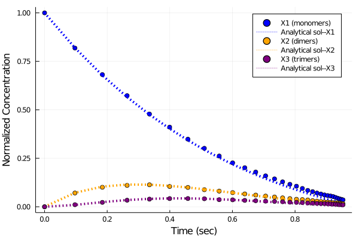

# Generating ReactionSystems Programmatically 
This tutorial shows how to programmatically construct a `ReactionSystem` corresponding to the chemistry underlying the [Smoluchowski coagulation model](https://en.wikipedia.org/wiki/Smoluchowski_coagulation_equation) using [ModelingToolkit](https://mtk.sciml.ai/stable/)/[Catalyst](https://catalyst.sciml.ai/dev/). A jump process version of the model is then constructed from the `ReactionSystem`, and compared to the model's analytical solution obtained by the [method of Scott](https://journals.ametsoc.org/view/journals/atsc/25/1/1520-0469_1968_025_0054_asocdc_2_0_co_2.xml) (see also [3](https://doi.org/10.1006/jcph.2002.7017)).

The Smoluchowski coagulation equation describes a system of reactions in which monomers may collide to form dimers, monomers and dimers may collide to form trimers, and so on. This models a variety of chemical/physical processes, including polymerization and flocculation.

We begin by importing some necessary packages.
```julia
using ModelingToolkit, Catalyst, LinearAlgebra
using DiffEqBase, DiffEqJump
using Plots, SpecialFunctions
```
Suppose the maximum cluster size is `N`. We assume an initial concentration of monomers, `Nₒ`, and let `uₒ` denote the initial number of monomers in the system. We have `nr` total reactions, and label by `V` the bulk volume of the system (which plays an important role in the calculation of rate laws since we have bimolecular reactions). Our basic parameters are then  
```julia
## Parameter
N = 10                       # maximum cluster size
Vₒ = (4π/3)*(10e-06*100)^3   # volume of a monomers in cm³
Nₒ = 1e-06/Vₒ                # initial conc. = (No. of init. monomers) / bulk volume
uₒ = 10000                   # No. of monomers initially
V = uₒ/Nₒ                    # Bulk volume of system in cm³

integ(x) = Int(floor(x))
n        = integ(N/2)
nr       = N%2 == 0 ? (n*(n + 1) - n) : (n*(n + 1)) # No. of forward reactions
```
The [Smoluchowski coagulation equation](https://en.wikipedia.org/wiki/Smoluchowski_coagulation_equation) Wikipedia page illustrates the set of possible reactions that can occur. We can easily enumerate the `pair`s of multimer reactants that can combine when allowing a maximal cluster size of `N` monomers. We initialize the volumes of the reactant multimers as `volᵢ` and `volⱼ`
  
```julia
# possible pairs of reactant multimers
pair = []
for i = 2:N
    push!(pair,[1:integ(i/2)  i .- (1:integ(i/2))])
end
pair = vcat(pair...)
vᵢ = @view pair[:,1]   # Reactant 1 indices
vⱼ = @view pair[:,2]   # Reactant 2 indices
volᵢ = Vₒ*vᵢ           # cm⁻³
volⱼ = Vₒ*vⱼ           # cm⁻³
sum_vᵢvⱼ = @. vᵢ + vⱼ  # Product index
```
We next specify the rates (i.e. kernel) at which reactants collide to form products. For simplicity, we allow a user-selected additive kernel, multiplicative kernel, or constant kernel. The constants(`B`,`b` and `C`) are adopted from Scott's paper [2](https://journals.ametsoc.org/view/journals/atsc/25/1/1520-0469_1968_025_0054_asocdc_2_0_co_2.xml)
```julia
# set i to  1 for additive kernel, 2 for multiplicative, 3 for constant
i = 1
if i==1
    B = 1.53e03                # s⁻¹
    kv = @. B*(volᵢ + volⱼ)/V  # dividing by volume as its a bi-molecular reaction chain
elseif i==2
    b = 3.8e11                 #  cm⁻³ s⁻¹
    kv = @. b*(volᵢ*volⱼ)/V
else
    C = 1.84e-04               # cm³ s⁻¹
    kv = fill(C/V, nr) 
end
```
We'll store the reaction rates in `pars` as `Pair`s, and set the initial condition that only monomers are present at ``t=0`` in `u₀map`.
```julia
# state variables are X, pars stores rate parameters for each rx
@parameters t       
@variables k[1:nr]  X[collect(1:N)](t)
pars = Pair.(k, kv)

# time-span
if i == 1
    tspan = (0. ,2000.)   
elseif i == 2
    tspan = (0. ,3000.)
else
    tspan = (0. ,350.)
end

 # initial condition of monomers
u₀    = zeros(Int64, N)
u₀[1] = uₒ  
u₀map = Pair.(X, u₀)   # map variable to its initial value
```
Here we generate the reactions programmatically. We systematically create Catalyst `Reaction`s for each possible reaction shown in the figure on [Wikipedia](https://en.wikipedia.org/wiki/Smoluchowski_coagulation_equation). When `vᵢ[n] == vⱼ[n]`, we set the rate to be `2*k[n]`, using the relationship between the coagulation kernel and the deterministic rate-law form (see [Laurenzi et.al](https://www.sciencedirect.com/science/article/pii/S0021999102970178))
```julia
# vector to store the Reactions in
rx = []              
for n = 1:nr
    # for clusters of the same size, double the rate
    if (vᵢ[n] == vⱼ[n]) 
        push!(rx, Reaction(k[n], [X[vᵢ[n]]], [X[sum_vᵢvⱼ[n]]], [2], [1]))
    else
        push!(rx, Reaction(k[n], [X[vᵢ[n]], X[vⱼ[n]]], [X[sum_vᵢvⱼ[n]]], 
                           [1, 1], [1]))
    end
end
rs = ReactionSystem(rx, t, X, k)
```
We now convert the `ReactionSystem` into a `JumpSystem`, and solve it using Gillespie's direct method. For details on other possible solvers (SSAs), see the [DifferentialEquations.jl](https://diffeq.sciml.ai/latest/types/jump_types/) documentation 
```julia
# solving the system
jumpsys = convert(JumpSystem, rs)
dprob   = DiscreteProblem(jumpsys, u₀map, tspan, pars)
jprob   = JumpProblem(jumpsys, dprob, Direct(), save_positions=(false,false))
jsol    = solve(jprob, SSAStepper(), saveat = tspan[2]/30)
```
Lets check the results for the first three polymers/cluster sizes. We compare to the analytical solution for this system:
```julia
# Results for first three polymers...i.e. monomers, dimers and trimers
v_res = [1;2;3]

# comparison with analytical solution
# we only plot the stochastic solution at a small number of points
# to ease distinguishing it from the exact solution
t   = jsol.t
sol = zeros(length(v_res), length(t))
if i == 1
    ϕ = @. 1 - exp(-B*Nₒ*Vₒ*t)    
    for j in v_res
        sol[j,:] = @. Nₒ*(1 - ϕ)*(((j*ϕ)^(j-1))/gamma(j+1))*exp(-j*ϕ)
    end
elseif i == 2
    ϕ = @. (b*Nₒ*Vₒ*Vₒ*t)
    for j in v_res
        sol[j,:] = @. Nₒ*(((j*ϕ)^(j-1))/(j*gamma(j+1)))*exp(-j*ϕ)
    end
else
    ϕ = @. (C*Nₒ*t)
    for j in v_res
        sol[j,:] = @. 4Nₒ*((ϕ^(j-1))/((ϕ + 2)^(j+1)))
    end
end

# plotting normalised concentration vs analytical solution
default(lw=2, xlabel="Time (sec)")
scatter(ϕ, jsol(t)[1,:]/uₒ, label="X1 (monomers)", markercolor=:blue)
plot!(ϕ, sol[1,:]/Nₒ, line = (:dot,4,:blue), label="Analytical sol--X1")

scatter!(ϕ, jsol(t)[2,:]/uₒ, label="X2 (dimers)", markercolor=:orange)
plot!(ϕ, sol[2,:]/Nₒ, line = (:dot,4,:orange), label="Analytical sol--X2")

scatter!(ϕ, jsol(t)[3,:]/uₒ, label="X3 (trimers)", markercolor=:purple)
plot!(ϕ, sol[3,:]/Nₒ, line = (:dot,4,:purple), label="Analytical sol--X3", 
      ylabel = "Normalized Concentration")
```
For the **additive kernel** we find



## Sources
1. https://en.wikipedia.org/wiki/Smoluchowski_coagulation_equation
2. Scott, W. T. (1968). Analytic Studies of Cloud Droplet Coalescence I, Journal of Atmospheric Sciences, 25(1), 54-65. Retrieved Feb 18, 2021, from https://journals.ametsoc.org/view/journals/atsc/25/1/1520-0469_1968_025_0054_asocdc_2_0_co_2.xml
3. Ian J. Laurenzi, John D. Bartels, Scott L. Diamond, A General Algorithm for Exact Simulation of Multicomponent Aggregation Processes, Journal of Computational Physics, Volume 177, Issue 2, 2002, Pages 418-449, ISSN 0021-9991, https://doi.org/10.1006/jcph.2002.7017.
