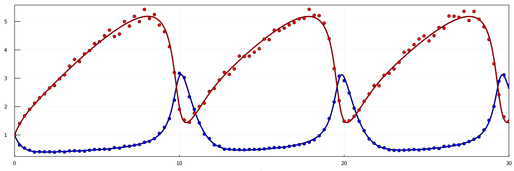
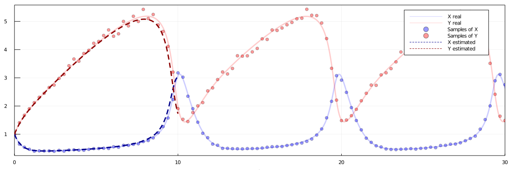
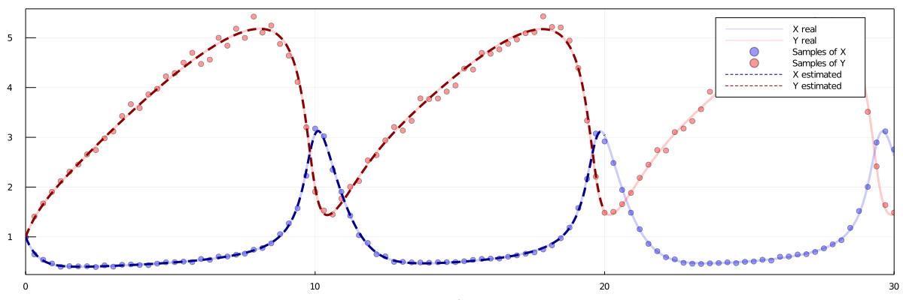
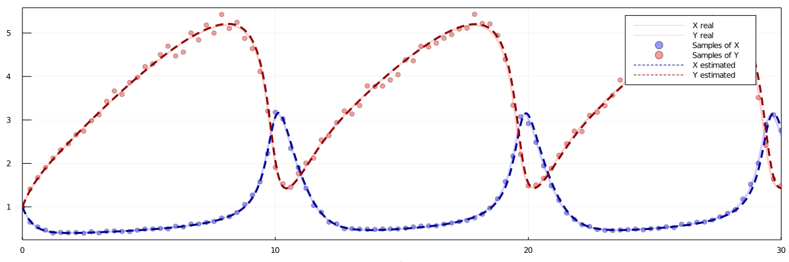
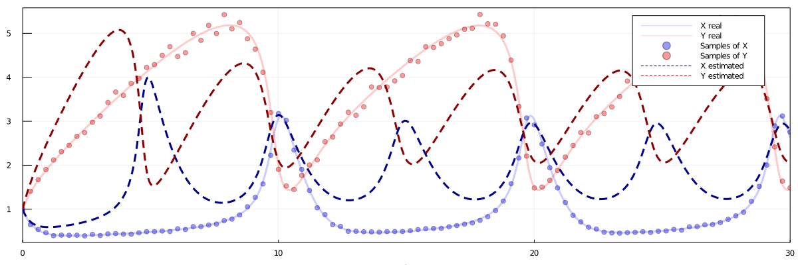

# Parameter Estimation
The parameters of a model, generated by Catalyst, can be estimated using various packages available in the Julia ecosystem. Refer [here](https://diffeq.sciml.ai/stable/analysis/parameter_estimation/) for a more detailed description. Below follows a quick tutorial of how [DiffEqFlux](https://diffeqflux.sciml.ai/dev/) can be used to fit a parameter set to data.

First, we fetch the required packages.
```julia
using OrdinaryDiffEq
using DiffEqFlux, Flux
using Catalyst
```

Next, we declare our model. For our example, we will use the Brusselator, a simple oscillator.
```julia
brusselator = @reaction_network begin
    A, ∅ → X
    1, 2X + Y → 3X
    B, X → Y
    1, X → ∅
end A B
p_real = [1., 2.]
```

We simulate our model, and from the simulation generate sampled data points (with added noise), to which we will attempt to fit a parameter et.
```julia
u0 = [1.0, 1.0]
tspan = (0.0, 30.0)

sample_times = range(tspan[1],stop=tspan[2],length=100)
prob = ODEProblem(brusselator, u0, tspan, p_real)
sol_real = solve(prob, Rosenbrock23(), tstops=sample_times)

sample_vals = [sol_real.u[findfirst(sol_real.t .>= ts)][var] * (1+(0.1rand()-0.05)) for var in 1:2, ts in sample_times];
```

We can plot the real solution, as well as the noisy samples.
```julia
using Plots
plot(sol_real,size=(1200,400),label="",framestyle=:box,lw=3,color=[:darkblue :darkred])
plot!(sample_times,sample_vals',seriestype=:scatter,color=[:blue :red],label="")
```


Next, we create an optimisation function. For a given initial estimate of the parameter values, p, this function will fit parameter values to our data samples. However, it will only do so on the interval [0,tend].
```julia
function optimise_p(p_init,tend)
    function loss(p)
        sol = solve(remake(prob,tspan=(0.,tend),p=p), Rosenbrock23(), tstops=sample_times)
        vals = hcat(map(ts -> sol.u[findfirst(sol.t .>= ts)], sample_times[1:findlast(sample_times .<= tend)])...)    
        loss = sum(abs2, vals .- sample_vals[:,1:size(vals)[2]])   
        return loss, sol
    end
    return DiffEqFlux.sciml_train(loss,p_init,ADAM(0.1),maxiters = 100)
end
```

Next, we will fit a parameter set to the data on the interval [0,10].
```julia
p_estimate = optimise_p([5.,5.],10.).minimizer
```

We can compare this to the real solution, as well as the sample data
```julia
sol_estimate = solve(remake(prob,tspan=(0.,10.),p=p_estimate), Rosenbrock23())
plot(sol_real,size=(1200,400),color=[:blue :red],framestyle=:box,lw=3,label=["X real" "Y real"],linealpha=0.2)
plot!(sample_times,sample_vals',seriestype=:scatter,color=[:blue :red],label=["Samples of X" "Samples of Y"],alpha=0.4)
plot!(sol_estimate,color=[:darkblue :darkred], linestyle=:dash,lw=3,label=["X estimated" "Y estimated"],xlimit=tspan)
```


Next, we use this parameter estimation as the input to the next iteration of our fitting process, this time on the interval [0,20].
```julia
p_estimate = optimise_p(p_estimate,20.).minimizer

sol_estimate = solve(remake(prob,tspan=(0.,20.),p=p_estimate), Rosenbrock23())
plot(sol_real,size=(1200,400),color=[:blue :red],framestyle=:box,lw=3,label=["X real" "Y real"],linealpha=0.2)
plot!(sample_times,sample_vals',seriestype=:scatter,color=[:blue :red],label=["Samples of X" "Samples of Y"],alpha=0.4)
plot!(sol_estimate,color=[:darkblue :darkred], linestyle=:dash,lw=3,label=["X estimated" "Y estimated"],xlimit=tspan)
```


Finally, we use this estimate as the input to fit a parameter set on the full interval of sampled data.
```julia
p_estimate = optimise_p(p_estimate,30.).minimizer

sol_estimate = solve(remake(prob,tspan=(0.,30.),p=p_estimate), Rosenbrock23())
plot(sol_real,size=(1200,400),color=[:blue :red],framestyle=:box,lw=3,label=["X real" "Y real"],linealpha=0.2)
plot!(sample_times,sample_vals',seriestype=:scatter,color=[:blue :red],label=["Samples of X" "Samples of Y"],alpha=0.4)
plot!(sol_estimate,color=[:darkblue :darkred], linestyle=:dash,lw=3,label=["X estimated" "Y estimated"],xlimit=tspan)
```


The final parameter set becomes `[0.9996559014056948, 2.005632696191224]` (the real one was [1.0, 2.0]`).


The reason we chose to fit the model on a smaller interval to begin with, and then extend the interval, is to avoid getting stuck in a local minimum. Here specifically, we chose our initial interval to be smaller than a full cycle of the oscillation. If we had chosen to fit a parameter set on the full interval immediately we would have received an inferior solution.
```julia
p_estimate = optimise_p([5.,5.],30.).minimizer

sol_estimate = solve(remake(prob,tspan=(0.,30.),p=p_estimate), Rosenbrock23())
plot(sol_real,size=(1200,400),color=[:blue :red],framestyle=:box,lw=3,label=["X real" "Y real"],linealpha=0.2)
plot!(sample_times,sample_vals',seriestype=:scatter,color=[:blue :red],label=["Samples of X" "Samples of Y"],alpha=0.4)
plot!(sol_estimate,color=[:darkblue :darkred], linestyle=:dash,lw=3,label=["X estimated" "Y estimated"],xlimit=tspan)
```



