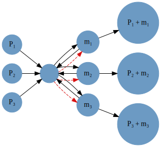
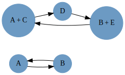

# Network Representations in Catalyst

In this tutorial, we explain some of the API functions mentioned in section [`Network-Analysis-and-Representations`](https://catalyst.sciml.ai/dev/api/catalyst_api/#Network-Analysis-and-Representations). For demonstration purpose, we reuse the repressilator model from previous tutorial.

## Network representation of the Repressilator `ReactionSystem`'s
We first load Catalyst
```@example s1
using Catalyst
```
Next we specify the chemical reactions that comprise the system using Catalyst
[`Reaction`](@ref)s
```@example s1
repressilator = @reaction_network Repressilator begin
       hillr(P₃,α,K,n), ∅ --> m₁
       hillr(P₁,α,K,n), ∅ --> m₂
       hillr(P₂,α,K,n), ∅ --> m₃
       (δ,γ), m₁ <--> ∅
       (δ,γ), m₂ <--> ∅
       (δ,γ), m₃ <--> ∅
       β, m₁ --> m₁ + P₁
       β, m₂ --> m₂ + P₂
       β, m₃ --> m₃ + P₃
       μ, P₁ --> ∅
       μ, P₂ --> ∅
       μ, P₃ --> ∅
end α K n δ γ β μ
reactions(repressilator)
```
```julia
g = Graph(repressilator);
```


The figure above represents species-reaction Graph in which the species are represented by the nodes of the Graph and edges denote the reactions between them.
The ODE's correponding to this `ReactionSystem` can be found [here](https://catalyst.sciml.ai/dev/tutorials/using_catalyst/)
## Complexes based Stoichiometry
In general, the `ReactionSystem`s are represented as first order ODEs of following form:
```math
\begin{equation}
    \nonumber \frac{dx}{dt} =
        N.
        \begin{pmatrix}
        h_{1}(x) & \cdots & 0\\ \vdots &  \ddots & \vdots\\ 0 & \cdots & h_{n}(x) \end{pmatrix}
        \begin{bmatrix}
        k_{1} \\
        k_{2}  \\
        \vdots \\
        k_{n} \\  
        \end{bmatrix}
\end{equation}
```
```math
\begin{equation}
    \frac{dx}{dt} = N .D(x) k
\end{equation}
```
where `N` is net stoichiometry matrix of the reaction system.
It is possible to rewrite the aformentioned ODE system as
```math
\begin{equation}\label{eqn1}
    \frac{dx}{dt} = Z.B. D(x) k
\end{equation}
```
where `Z` is a complex stoichiometric matrix of size `num. of species x num. of complexes`, `B` is an incidence matrix of size `num. of complexes x num. of reactions`, where `c` is number of reaction complexes.
These matrices can be obtained in following way:
```@example s1
Z = complexstoichmat(repressilator)
```
```@example s1
rcs, B = reactioncomplexes(repressilator);
```
`rcs` here returns the information about unique reaction complexes that define the `ReactionSystem`. It is a vector of vector type `ReactionComplexElement`. `ReactionComplexElement` containing a tuple of index of participating species(as per sequence returned by `species(repressilator)`), and its corresponding stoichiometric coefficient, respectively.

```@example s1
rcs
```
One may also find the occurence of these complexes in different reactions as either substrates or products using API function `reactioncomplexmap(repressilator)`.
The columns of `B` matrix depict the consumption and generation of such unique reaction complex(with entries -1 and 1, respectively) for each `Reaction`.
```@example s1
B
```
This also gives us an idea of the `Graph` that can be constructed to depict the `ReactionSystem` with nodes as `ReactionComplexElement` and edges as `Reaction`. To visualise the complex graph, Catalyst provides an API function as follows,
```julia
complexgraph(repressilator)
```



The `ODESystem` from Equation (2) is equivalent to the one we get from `convert(ODESystem, repressilator)`. We verify this as follows:
```@example s1
odesys = convert(ODESystem, repressilator);
oderhs = [equations(odesys)[i].rhs for i in 1:numspecies(repressilator)];
```
Check if this is true !
```@example s1
isequal(oderhs, Z*B*oderatelaw.(reactions(repressilator)))
```

## Aspects of Reaction Network Structure
Lets assume another example to highlight some more aspects of the reaction networks, using some more API functions
```@example s1
rn = @reaction_network begin
     (k1,k2), A + B <--> C
     k3, C --> D+E
     (k4,k5), D+E <--> F
     (k6,k7), 2A <--> B+G
     k8, B+G --> H
     k9, H --> 2A
end k1 k2 k3 k4 k5 k6 k7 k8 k9;

# compute incidence matrix as previously mentioned
B = reactioncomplexes(rn)[2];
```
```julia
# and visualise the graph using Graphviz based API function
complexgraph(rn)
```


Lets compute a Graph from incidence matrix
```@example s1
incidencegraph = incidencematgraph(B);
```
#### Linkage classes and subnetworks from the reaction network
Figure above shows that the `ReactionSystem` `rn` is composed of two distinct “pieces,” one containing the complexes `A+B`, `C`,` D+E`, and
`F`, the other containing the complexes `2A`, `B + G`, and` H`. These two pieces can be viewed as non-linked set of complexes. These sets {`A+B`, `C`,` D+E`, `F`} and {`2A`, `B + G`,`H`} are the "linkage classes"of the reaction network.THe function `linkageclasses` returns vector of the indices of reaction complexes participating in each set of linkage-classes(Note: indices of reaction complexes found from function `reactioncomplexes` as previously explained)
```@example s1
lcs = linkageclasses(incidencegraph)
```
This however, does not tell us what are the individual `ReactionSystem`'s that form these linkage classes. This can be deduced from function `subnetworks` as follows. `subnetwork` returns a vector of `ReactionSystems`forming linkage classes.
```@example s1
subnets = subnetworks(rn, lcs)
# check the reactions in each subnetworks
reactions.(subnets)
```
```julia
 # or visualise them as
 complexgraph(subnets[1])
```

and,
```julia
 complexgraph(subnets[2])
```


#### Deficiency of the network
The rank of reaction network is defined as the subspace spanned by the net-stoichiometry of reaction-network. In other words, the number of uniquely represented "reactions vectors"(or the columns of net-stoichiometric matrix) is the rank of the reaction network, refer Feinberg [(1)](https://link.springer.com/book/10.1007/978-3-030-03858-8?noAccess=true).
This can be calculated as follows
```@example s1
using LinearAlgebra
s = rank(netstoichmat(rn))
```
Feinberg [(1)](https://link.springer.com/book/10.1007/978-3-030-03858-8?noAccess=true) shows that number of these uniquely represented "reaction vectors" cannot exceed the `no. of complexes - no. of linkage classes`. This puts an upper bound on the rank of reaction network, and allows us to define the deficiency of the reaction network
`δ = no. of complexes - no. of linkage classes - s`
This gives us a measure of how independent the reaction vectors are, provided the network’s linkage classes.
```@example s1
# crude way...note B i.e. incidence matrix has size of no. of complexes x no. of reactions
δ = size(B,1) - length(lcs) - rank(netstoichmat(rn))
```
or using Catalyst API function `deficiency`.
```@example s1
δ = deficiency(netstoichmat(rn), incidencegraph, lcs)
```
We may also define deficiencies for individual subnetworks in the linkage classes as follows,
```@example s1
linkage_δ = linkagedeficiencies(subnets, lcs)
```
It follows linear algebra that ,`∑ (linkage_δ) <= δ`

Quoting Feinberg [(1)](https://link.springer.com/book/10.1007/978-3-030-03858-8?noAccess=true),

> Deficiency zero networks are ones for which the reaction vectors are as independent as the partition of complexes into linkage classes will allow. And, any subnetwork of a deficiency zero network is also a deficiency zero network.

#### Reversibility of the network
Simply put, reaction network is defined reversible if, the "arrows" of the reactions are symmetric such that every reaction is accompanied by its backward reaction. Catalyst API provides function `isreversible` to determine whether the reaction network is reversible or not, based on the Graph constructed from incidence matrix for interaction of reaction complexes.
Example
```@example s1
rn = @reaction_network begin
  (k1,k2),A <--> B
  (k3,k4),A + C <--> D
  (k5,k6),D <--> B+E
  (k7,k8),B+E <--> A+C
end k1 k2 k3 k4 k5 k6 k7 k8;
# find the graph from incidence matrix for reaction complexes
incidencegraph = incidencematgraph(reactioncomplexes(rn)[2]);
isreversible(incidencegraph)
```
Consider another example,
```@example s1
rn = @reaction_network begin
  (k1,k2),A <--> B
  k3, A + C --> D
  k4, D --> B+E
  k5 ,B+E --> A+C
end k1 k2 k3 k4 k5;
incidencegraph = incidencematgraph(reactioncomplexes(rn)[2]);
isreversible(incidencegraph)
```
```julia
complexgraph(rn)
```


It is evident from the Figure above that the network is not "reversible", but has some sense of reversibility, such that each reaction-complex "ultimately reacts"(or indirectly reacts) to every other complex. This is known as "weakly reversible" system. One can test the network for "weak" reversibility by using function `isweaklyreversible` as follows
```@example s1
# need subnetworks from the reaction network first
B=reactioncomplexes(rn)[2]
lcs = linkageclasses(incidencematgraph(B));
subnets = subnetworks(rn, lcs)
isweaklyreversible(subnets)
```
Needless to say, every "reversible" network is also "weakly reversible", but the vice versa may or may not be true.
## Sources
1) [Foundations of Chemical Reaction Network Theory, Martin Feinberg](https://link.springer.com/book/10.1007/978-3-030-03858-8?noAccess=true)
